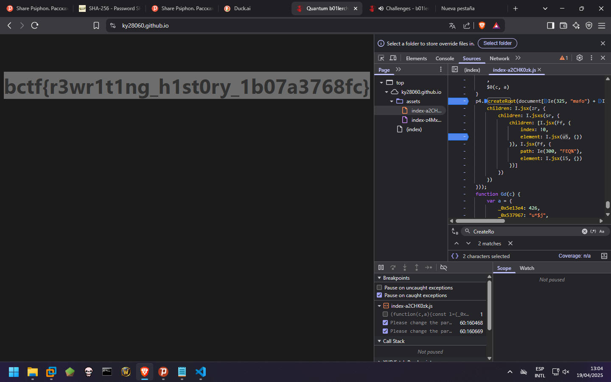

Revisamos el codigo fuente para ver donde estara la bandera, encontramos que existe en un trouble_at_the_spa/src/Flag.tsx
```js
export default function Flag() {return (
        <section className=text-center pt-24>
            <div className=flex items-center text-5xl font-bold justify-center>
                {'bctf{test_flag}'}
            </div>
        </section>
    )
}
```

El cual importa el main como ruta sin embargo no nos permite acceder

```js
...
// Pages
import App from './App.tsx';
import Flag from './Flag.tsx';
createRoot(document.getElementById('root')!).render( 
    <StrictMode>
        <BrowserRouter>
            <Routes>
                <Route index element={<App />} />
                <Route path="/flag" element={<Flag />} />
            </Routes>
        </BrowserRouter>
    </StrictMode>
);
...
```

Desde el debugger del navegador durante la renderizacion alteramos los parametros de la funcion createRoot obteniendo la flag:

