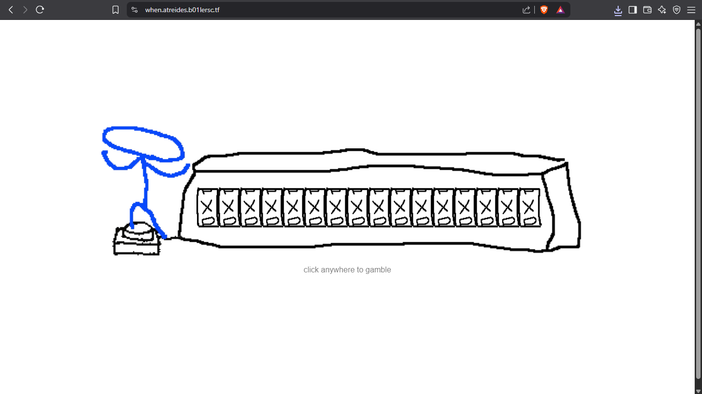
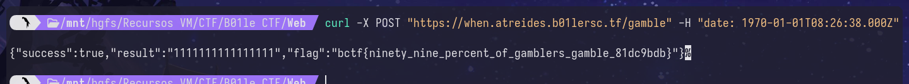

Tenemos una web de ruleta. Al revisar las peticioines en la pestana network del navegador vemos que le hace una peticion a:

```
    when.atrides.b01lersc.tf/gamble -> POST
```

Retornando un json
```
{"success":false,"result" : "00000000000011"}
```

Si filtramos por la cadena gamble vemos una funcion que toma la cabecera date y la comvierte en un SHA-256, si los primeros dos bytes de este has son 255 nos devolvera la bandera.

Creamos un script en pyton para obtener dicho hash:

```python
import hashlib
from datetime import datetime, timedelta

def toDate(value : int):
    seconds = value / 1000.0
    fecha = datetime(1970, 1, 1) + timedelta(seconds=seconds)
    mili = value % 1000
    return fecha.strftime("%Y-%m-%dT%H:%M:%S") + f".{mili:03d}Z"


def find_hash_with_prefix(prefix):
    nonce = 0 
    #nonce = 30398 + 1
    try:
        while True:
            num = nonce
        # Crea un string a partir del nonce (solo números)
            input_string = str(num)
        # Calcula el hash SHA-256
            hash_result = hashlib.sha256(input_string.encode()).hexdigest()
        # Verifica si el hash comienza con el prefijo deseado
            if hash_result.startswith(prefix):
                return int(input_string) * 1000, hash_result
            nonce += 1
    except KeyboardInterrupt:
        print()
        print("Remain: ",nonce)
# Llama a la función con el prefijo "ffff"
prefix = "ffff"
input_string, hash_result = find_hash_with_prefix(prefix)

print(f"Date: {toDate(input_string)}")
print(f"Hash: {hash_result}")
```
Obteniendo: 
```
Date: 1970-01-01T08:26:38.000Z
Hash: ffff8ed56f65caf0019f90d65b7f158b862efcab5c4517a76c01c73acf92d99b
```

Y ahora solo nos queda obtener la flag mandando una solicitud por POST alterando el header de date de la siguiente manera:

```bash
curl -X POST "https://when.atreides/b01lersc.tf/bgamble" -H "date: 1970-01-01-T08:26:38.000Z"
```


