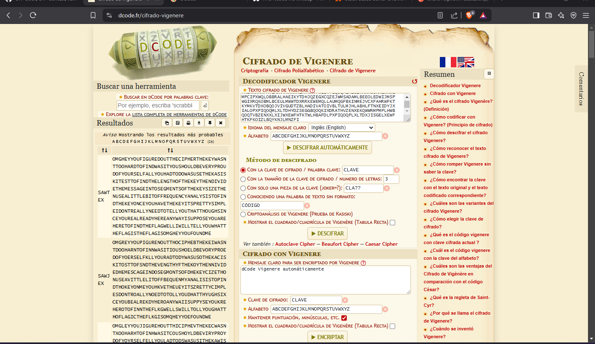

Llevamos el hash a decode.fr y vemos que es un cifrado vigenere si le aplicamos fuerza bruta aparece el siguiente mensaje:



```
OMGHEYYOUFIGUREDOUTTHECIPHERTHEKEYWASNTTOOHARDTOFINDWASITYOUSHOULDBEVERYPROUDOFYOURSELFALLYOUHADTODOWASUSETHEKASISKITESTTOFINDTHELENGTHOFTHEKEYTHENDIVIDETHEMESSAGEINTOSEGMENTSOFTHEKEYSIZETHENUSEALITTLEBITOFFREQUENCYANALYSISTOFINDTHEKEYONCEYOUHAVETHEKEYITSPRETTYSIMPLEIDONTREALLYNEEDTOTELLYOUTHATTHOUGHSINCEYOUREALREADYHEREANYWAYISUPPOSEYOUAREHERETOFINDTHEFLAGWELLIWILLTELLYOUWHATTHEFLAGISTHEFLAGISOMGHEYYOUFOUNDME
```

OMG HEY YOU FIGURE DOUT THE CIPHER THE KEY WASNT TOO HARD TO FIND WAS IT YOU SHOULD BEVERY PROUD 
OF YOURSELF ALL YOU HAD TO DO WAS USE THE KASISKI TEST TO FIND THE LENGTH OF THE KEY THEN DIVIDE THE MESSAGE 
INTO SEGMENTS OF THE KEY SIZE THE NUSE A LITTLE BIT OFF REQUENCY ANALYSIS TO FIND THE KEY ONCE YOU HAVE THE KEY ITS
PRETTY SIMPLE I DONT REALLY NEED TO TELL YOU THAT THOUGH SINCE YOU REAL READY HERE ANYWAY I SUPPOSE YOU ARE HERE TO FIND
THE FLAG WELL I WILL TELL YOU WHAT THE FLAG IS THE FLAG IS texsaw{OMGHEYYOUFOUNDME}


