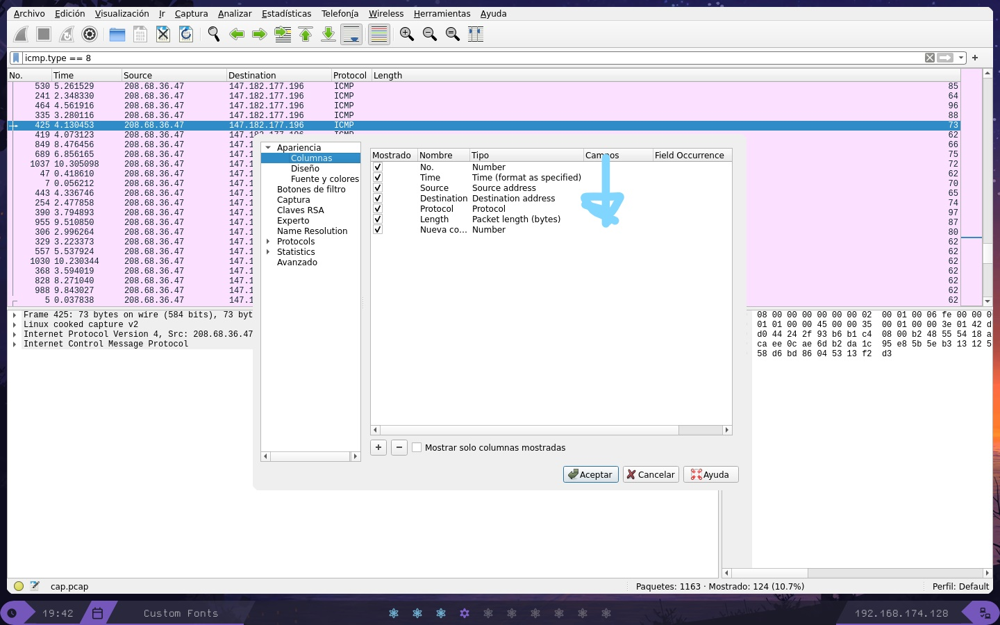
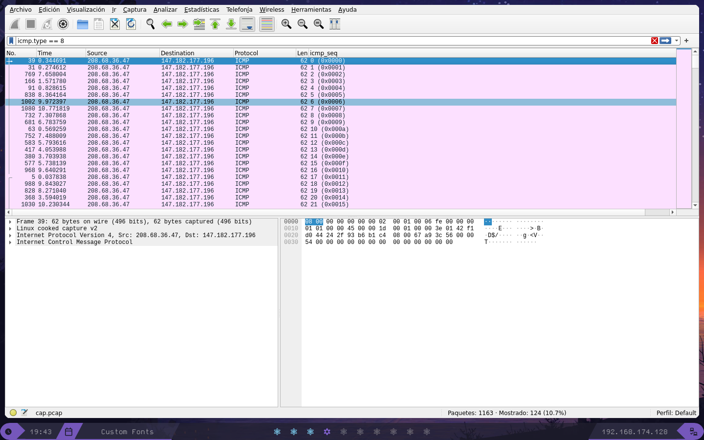

Crearemos un filtro para las trazas icmp exitosas:
````
icmp.type == 8
````

luego en el wireshark agregamos una columna seq como se muestra en la siguiente imagen


En el contenido de los paquetes vemos la flag:


```
TexSAW{not_the_fake_one}
```
