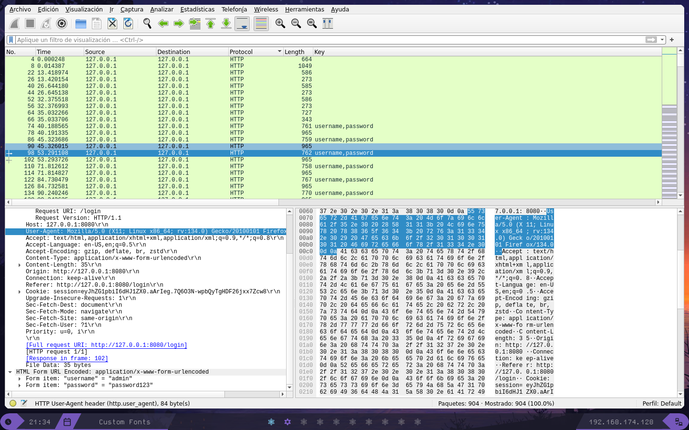
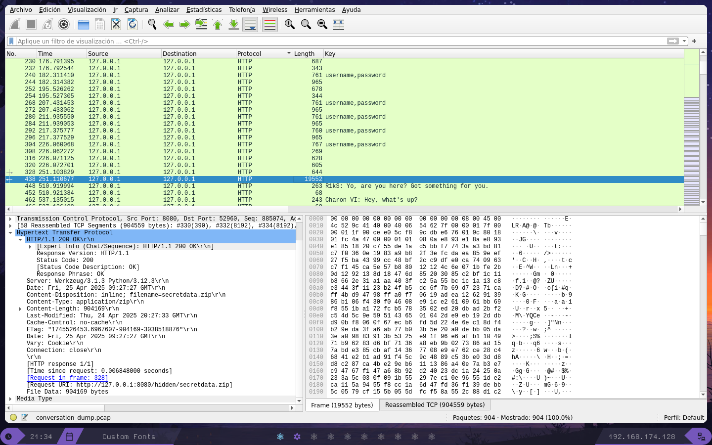

# Dark Web
Primero analizaremos la captura con wireshark filtrando por peticiones http, a primera vista vemos que el usuario intenta acceder a un sitio con credenciales mediate fuerza bruta.


Vemos que accede mediante una inyeccion sql de tipo bypass, accediendo a un sitio y descargando un archivo zip **secret_data.zip**, volcamos la data e intentamos descomprimir


Vemos que pide contrasena y que tiene un archivo **hacker.png** en su interior, continuamos enumerando para ver si obtenemos algo mas. Luego podemos ver algun tipo de conversacion entre dos individios, utilizando el siguiente filtro:

```
http.user_agent == "curl/8.5.0"
```
Vemos una conversacion en la que mencionan que esas son contrasena leakeadas de la base de datos, por lo que intentaremos ver si son debiles [aqui](http://hashes.com)


Nos damos cuenta que las claves estan organizadas y poco a poco van formando una contrasena, asi que, teniendo en cuenta que estamos trabajando con hashes MD5 vamos a obtener la contrasena mediante fuerza bruta con el siguiente codigo en python:

```python
from hashlib import md5
from string import printable

def hash_md5(password : str):
    hashlib = md5()
    hashlib.update(password.encode())
    return hashlib.hexdigest()

password = ""
chars = printable[:-5]
md5sums = open("../evidences/password_list").read().strip().split("\n")

breaked = 0
while breaked < len(md5sums):
    for char in chars:
        if hash_md5(password+char) == md5sums[breaked]:
            password += char
            breaked += 1
            break
    print(f"\rPassword: {password}",end="")
print("\n[+] Success.")
```

Esto nos dara la siguiente contrasena: Sup3r$3cre7P4$Sw0rd!

Con la cual abriremos el archivo zip y nos encontamos con una imagen, la imagen no tiene datos contenidos, ni se le oculto nada en los metadatos ni con steghide, sin embargo si revisamos los bits menos significativos con el comando:

```
zsteg -a hacker.png | grep "UVT"
```

Obtenemos la flag: UVT{4_l0T_0f_lay3r5_70_unc0v3r_1nn1t?}