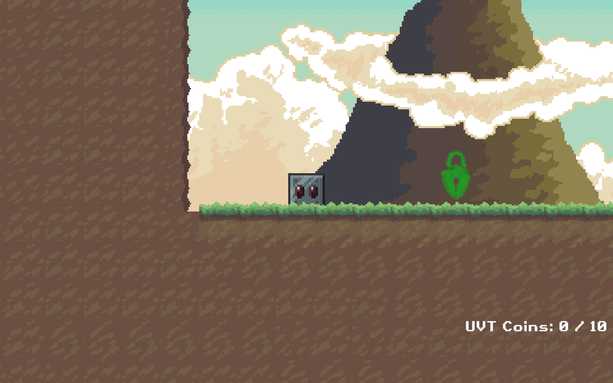
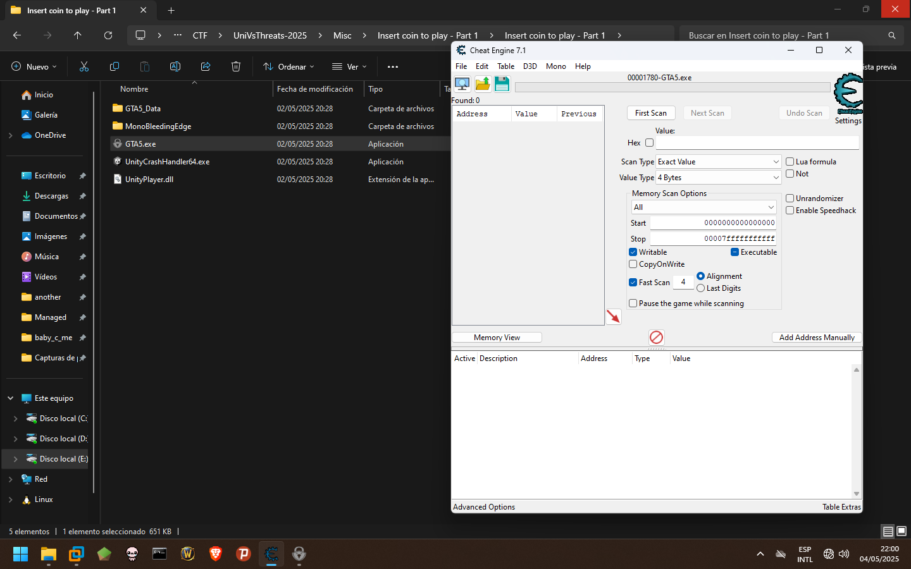
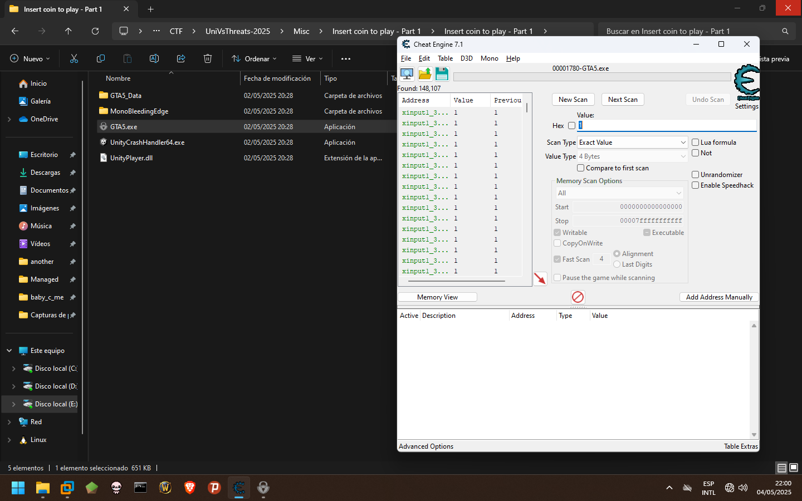
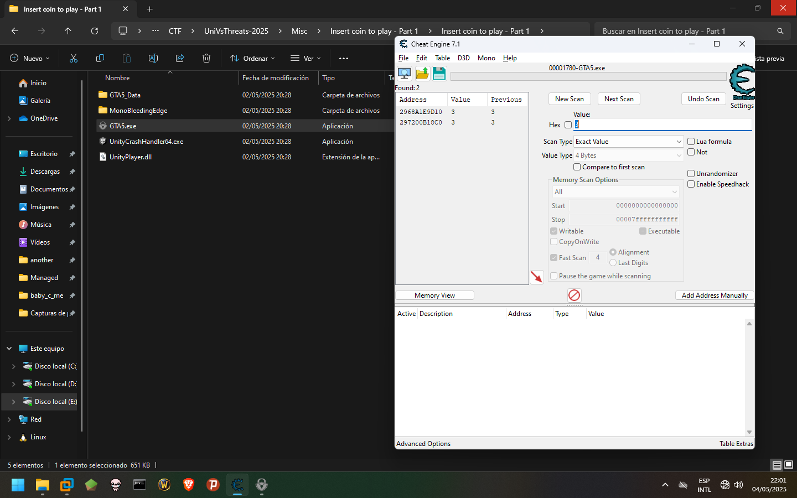
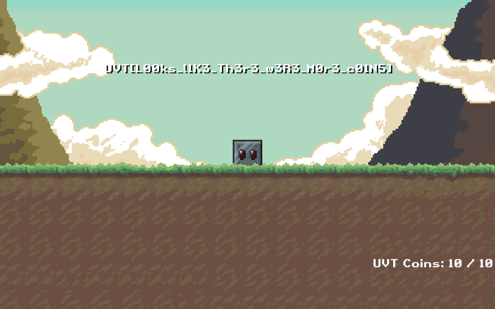

# Insert coin to play - Part 1
Primero iniciamos la aplicacion.

Podemos darnos cuenta de que solo existen 5 monedas y necesitamos 10 para obtener la flag. Por lo que utilizaremos **Cheat Engine** para
modificar los valores de memoria.

Utilizando el valor actual de las monedas, vamos recolectando a la par que lanzamos escaneos a la memoria con el valor actual de las monedas.

Luego de conseguir al menos 3 monedas vemos que solo nos quedan 2 direcciones, asi que editaremos el valor a 9.

Al conseguir la ultima moneda obtendremos la flag.
