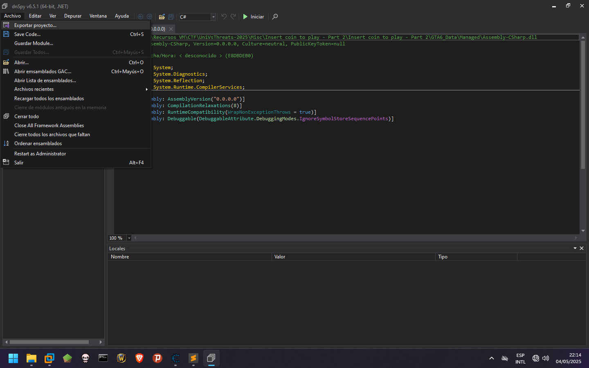
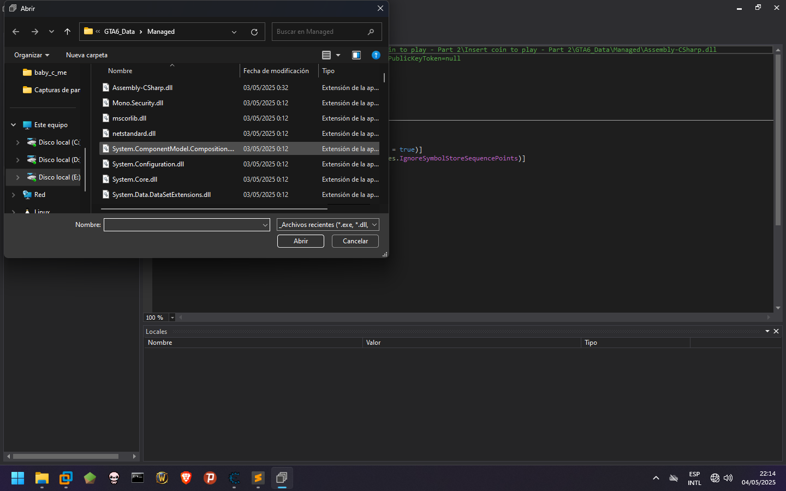
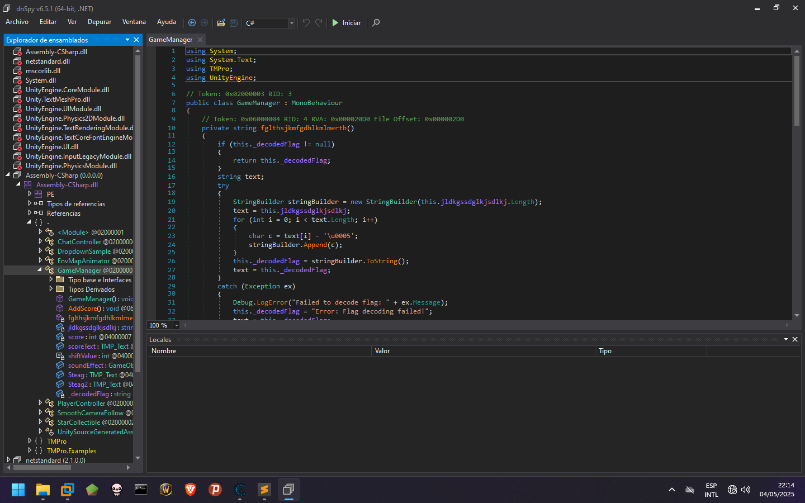
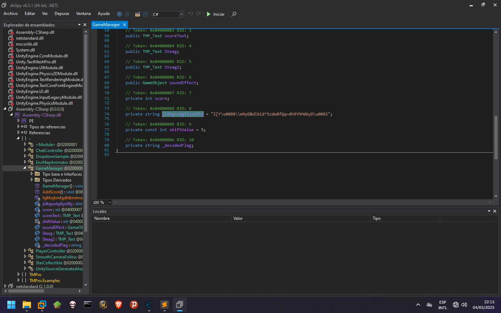
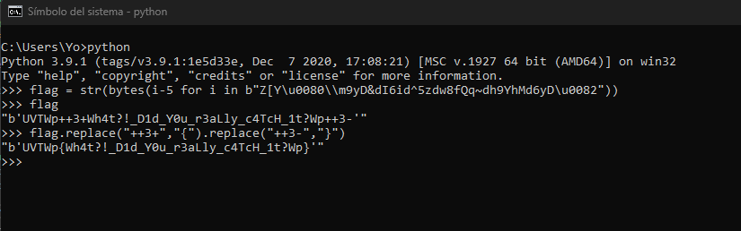

# Insert coin to play - Part 2
En este caso es haremos otro tipo de analisis, al editar la memoria con Cheat Engine vemos que no surge efecto, por lo que
debemos darle otro enfoque.

En este caso utilizaremos la herramiento **dnSpy**.

Con ella abriremos el archivo **Assembly-CSharp.dll** en el que veremos el codigo fuente.

Una vez cargado vamos al nodo GameManager en el cual vemos la logica principal del juego y alli encontramos una funcion importante.

La funcion cifra con Cesar con un desplazamiento de -5 todos los caracteres de la bandera, la cual vemos accediendo al objeto instanciado.

Haciendo el proceso podemos obtener la flag
