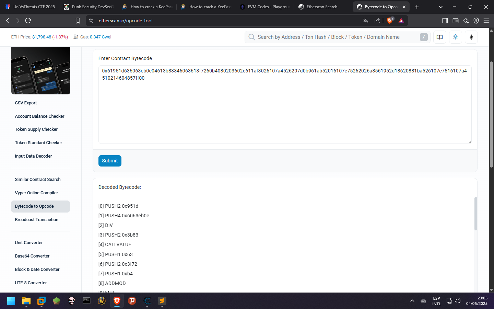
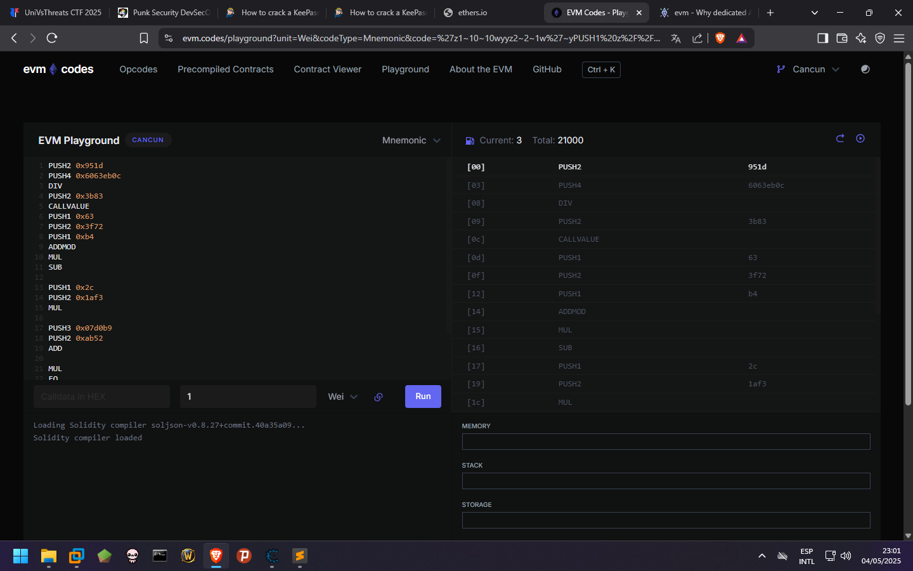
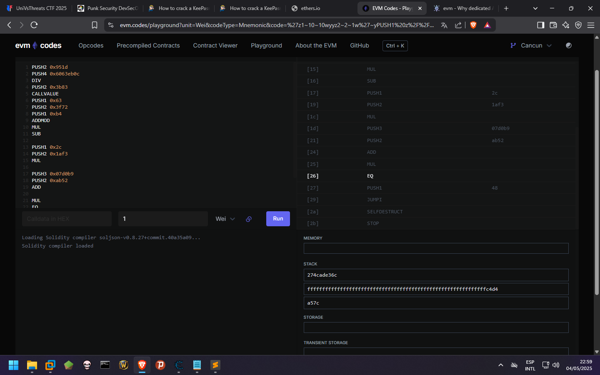

# Evil Vending Machine
Se nos da una cadena en hexadecimal de la cryptomoneda Etherum.

```
0x61951d636063eb0c04613b83346063613f7260b4080203602c611af3026107a4526207d0b961ab52016107c75262026a8561952d18620881ba526107c7516107a4510214604857ff00
```

Si vamos a la [web de etherscan](https://etherscan.io/opcode-tool), en la seccion de Opcodes podemos pasarle la cadena para obtener los Opcodes de la moneda


La web nos retorna los siguientes Opcodes:

```
PUSH2 0x951d
PUSH4 0x6063eb0c
DIV
PUSH2 0x3b83
CALLVALUE
PUSH1 0x63
PUSH2 0x3f72
PUSH1 0xb4
ADDMOD
MUL
SUB
PUSH1 0x2c
PUSH2 0x1af3
MUL
PUSH2 0x07a4
MSTORE
PUSH3 0x07d0b9
PUSH2 0xab52
ADD
PUSH2 0x07c7
MSTORE
PUSH3 0x026a85
PUSH2 0x952d
XOR
PUSH3 0x0881ba
MSTORE
PUSH2 0x07c7
MLOAD
PUSH2 0x07a4
MLOAD
MUL
EQ
PUSH1 0x48
JUMPI
SELFDESTRUCT
STOP
```

Para cumplir el reto se nos pide que ingresemos el CALLVALUE como bandera, para ello debemos entender que hace el codigo, podemos utilizar la **EVM** oficial en la web de [EVM](https://www.evm.codes/)

*Nota: Se adjunto una implementacion en python en caso de no tener acceso, descargar [aqui](script/evm.py)* 

Ejecutamos las instrucciones paso a paso y podemos ver que son comparados dos valores y si son iguales es aceptada la moneda de lo
contrario sera descartada, valor el cual depende de CALLVALUE.


Podemos realizar el proceso inverso para obtener el CALLVALUE

call value = (0x274cade36c + 0x3b83) // 0x57

Y obtenemos la bandera en hexadecimal:UVT{0x73a3d729}