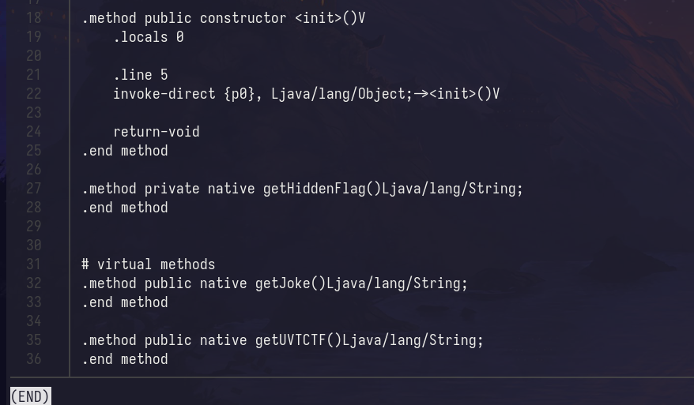
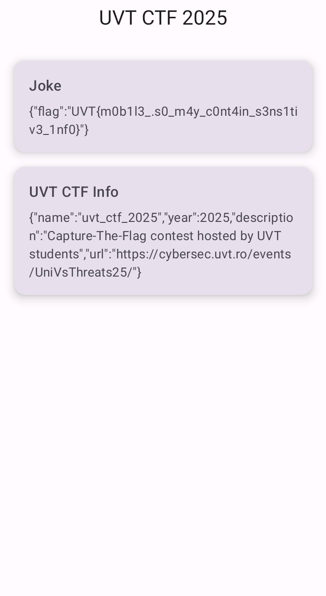

# Jokes and Info
Instalamos la aplicacion en nuestro dispositivo de prueba.


Comenzaremos descompilando la aplicacion con **apktool**.

```bash
apktool d jokes_and_info.apk
```

Revisando los archivos smali vemos un fichero inusual **Utils.smali** este contiene una funcion privada*getHiddenFlag* y una una funcion publica *getJokes*, este parece ser la funcion que salta al iniciar la apk en el primer campo.


Revisamos donde aparece referenciada la funcion *getJokes* y la cambiamos por *getHiddenFlag* ademas de cambiar el estado de privado
a publico en el fichero **Utils.smali**, y ahora recompilamos la apk con los siguientes comandos.

```bash
mkdir patch
apktool b jokes_and_info
zipalign -v 4 jokes_and_info/dist/jokes_and_info.apk patch/jokes_and_info.apk
keytool -genkey -v -keystore my.keystore -alias alias_name -keyalg RSA -keysize 2048 -validity 10000
apksigner  sign --ks my.keystore --v1-signing-enabled true --v2-signing-enabled true patch/jokes_and_info.apk
#adb install jokes_and_info.apk
```

Y ya veriamos la flag.
