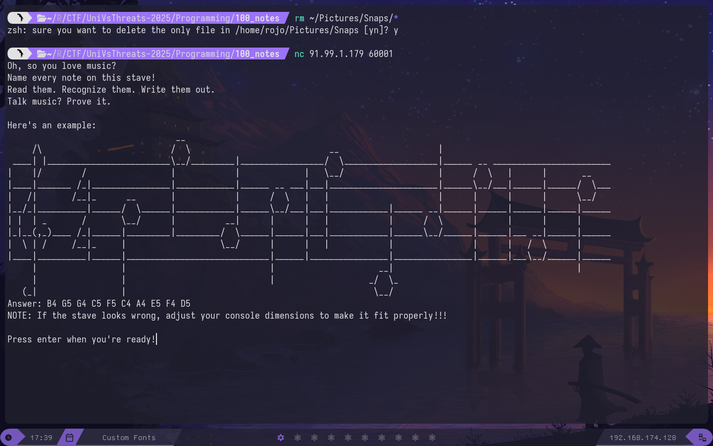

# 100 Notes
Este desafio no tiene mucho misterio, nos conectamos a un servicio que nos da notas musicales.


El desafio consiste en acertar 100 partituras seguidas, esto se resuelve con el siguiente [script](scripts/solve.py).

```python
from pwn import *

def get_value(matrix,index,delimiter):
    value = ""
    for y in range(len(matrix)):
        value += "\n" + "".join(matrix[y][index * 10 + 2 + delimiter:index * 10 + 8 + delimiter])
    return value.strip("\n")

def drawn(matrix,data):
    x = 0
    y = 0
    for char in data:
        if char == "\n":
            y += 1
            x = 0
            continue
        try:
            matrix[y][x] = char
        except:
            print(y,x)
            exit(1)
        x += 1

def read_partiture(matrix):
    solve = []

    notes = 0
    delimiter = 0
    while notes < 10:
        solve.append(translate[get_value(matrix,notes+2,delimiter)])
        #print(get_value(matrix,notes+2,delimiter))
        #print("DELIMITER")
        notes+=1
        if notes % 4 == 0:
            delimiter += 1

    return solve

def send_payload():
    data = r.recvuntilS(b"Answer: ").split("Answer: ")[0]
    if not data:
        return False
    print(data)
    drawn(matrix,data)
    solve = read_partiture(matrix)
    print("Answer: ",solve)
    r.sendline(" ".join(solve).encode())
    r.recvline()
    return True

d = list(dict.fromkeys(list(map(lambda i:i.strip("\n"),open("notes").read().split("DELIMITER")[:-1]))))
nums = open("nums").read().split()
translate = dict(zip(d,nums))

genMatrix = lambda : [[""]*122 for _ in range(14)]
matrix = genMatrix()

#print(translate)

context.log_level = "FATAL"
r = remote("91.99.1.179",60001)
r.sendlineafter(b"Press enter when you're ready!",b"")


for _ in range(100):
    state = send_payload()
print("FINISH:\n",r.recvallS(1))
```

Y asi obtenemos la flag:

```
UVT{th3_n0t3s_w3r3_1ns1d3_us_4ll_4l0ng}
```