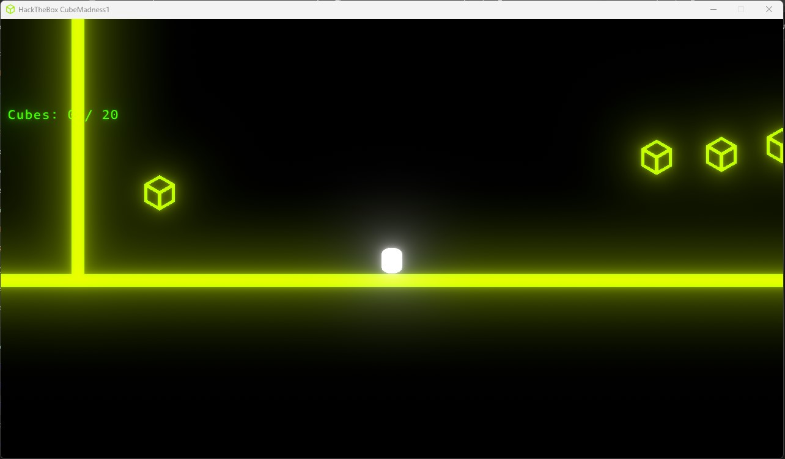
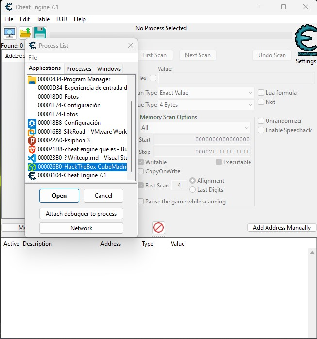
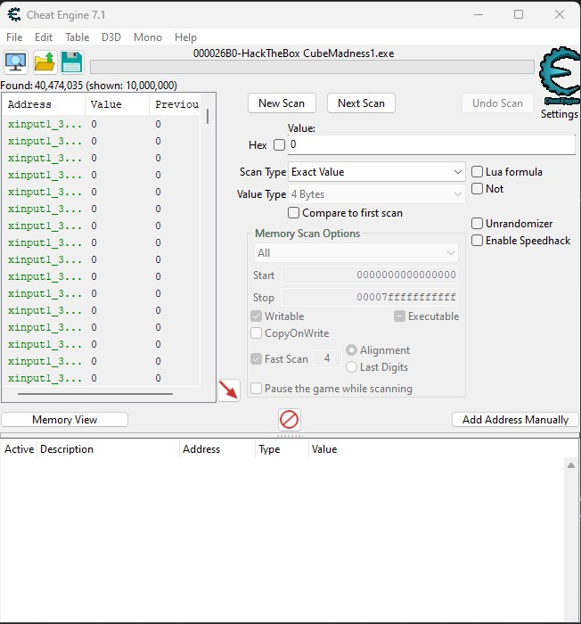
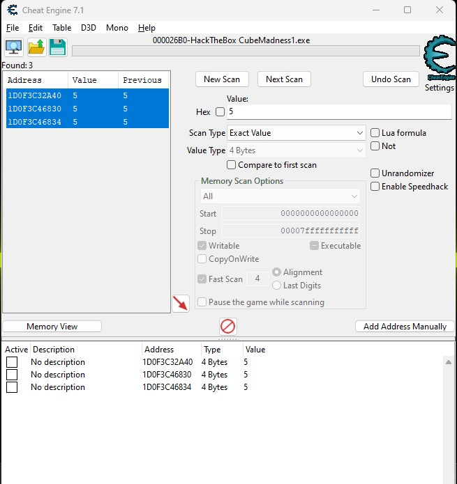
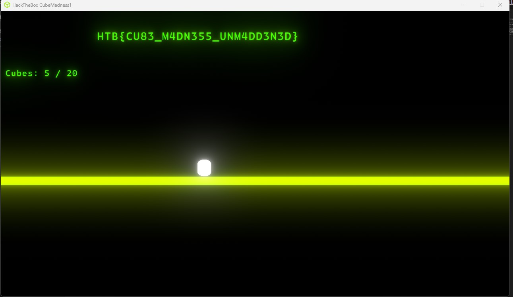

# Cube Madness
En este reto comenzamos con un cubito en la pantalla y aparentemente al conseguir 20 puntos blancos obtenemos la flag, sin embargo esto no es posible ya que solo existen 4 en pantalla.

Para resolver este reto, enfocaremos la solucion a la herramienta Cheat Engine.

# Cheat Engine
Es una aplicacion de software libre que nos permite ver y modificar la memoria en tiempo real.

# Solucion
1. Adjuntamos cheat engine al proceso en cuestion.

2. Cheat Engine tiene la capacidad de encontrar el contenido de las direcciones de memoria, por lo que vamos a buscar mediante el metodo de prueba de error la direccion de memoria en la cual se encuentra el valor de los puntos.

3. En este primer escaneo por le valor 0, aparecen miles de direcciones que lo contienen (es una mala idea buscar un valor nulo), por lo que debemos reducir el espectro de posibles registros para evitar fallos por alterar registros indebidos. Ahora recogeremos un punto y escaneamos, luego dos y asi hasta que no tengamos mas puntos para minimizar la cantidad de registros direcciones de memoria posibles.

4. Ahora, para modificar , marcamos las direcciones y pulsamos Control + E y ponemos el valor en cuestion. 20 y ya apareceria la bandera.

