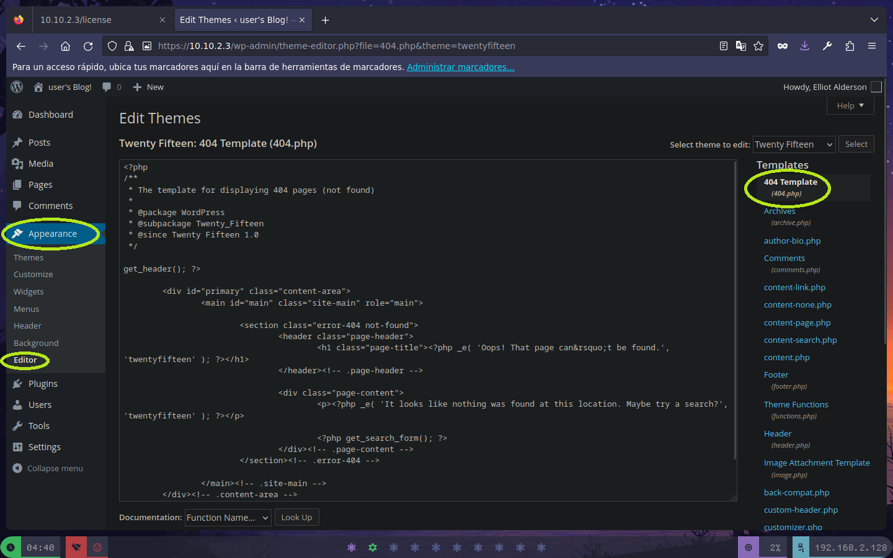

# Reconocimiento y Enumeracion:
-	Revisamos que la maquina esta activa
````bash
ping -c 1 <IP>
````


Con esta salida vemos la estamos frente a una maquina linux, vamos a enumerar todo el rango de puertos por TCP.
````bash
nmap -p- --open -sS --min-rate=5000 -n -Pn -vvv <IP> -oG allports
````


-	Profundizamos mas en el escaneo para obtener mas informacion sobre las versiones y servicios que corren en el sistema

````bash
nmap -sCV -p22,80,443 --script=http-enum -n -Pn <IP> -oA info
````


**Nota: En ambos puertos http vemos la misma web**

Con la salida vemos que estamos frente a un gestor de contenidos Wordpress por lo que toca pensar en como infiltrarnos en este. Toca revisar los archivos
que descubrimos:

- robots.txt

````
User-agent: *
fsociety.dic 
key-1-of-3.txt
````
Encontramos la flag 1 de 3.


Ahora tenemos dos caminos de enumeracion.

## Camino 1

### Fuzzing
Fuzzeamos directorios en el servidor para encontrar algo de interes
````bash
wfuzz -c --hc=404 -w '/usr/share/wordlists/dirbuster/directory-list-2.3-medium.txt http://[IP]/FUZZ'
````

Revisando los directorios vemos algo interesante en /license.


Encontramos una cadena en base64 que al llevarla a texto plano obtenemos posibles credenciales de usuario

````
ellitot:ER28-0652
````

## Camino 2

### Fuerza bruta al login

Podemos pensar que el diccionario que encontramos anteriormente en el robots.txt contenga las contrasenas de alguno de los usuarios del sistema, sim embargo 
vemos que el diccionario es bastante extenso y tiene varias repeticiones, vamos a optimizarlo con el comando:

```bash
cat fsociety.dic | sort -u  > new_dict.dic
```

Probamos el mismo diccionario tanto para usuarios 


como para contrasenas


**Y ya tendriamos las credenciales para entrar**


# Explotacion de Vulnerabilidades:
Luego de investigar un poco podemos darnos cuenta de que es posible inyectar una carga útil en el editor de el tema actual, de la siguiente manera.
Una vez en configuración nos desplazamos a:

Luego aquí, inyectamos nuestra reverse [Shell](https://github.com/pentestmonkey/php-reverse-shell):


Ahora esperamos a que nos llegue la shell desde netcat
```
rlwrap sudo nc -nlvp 443
```
Ahora hacemos un curl http://[IP]/asd para que de error y se active el 404.php y obtenemos una shell 


# Post-Explotacion
Una vez dentro se realiza un tratamiento de la TTY, como www-data.
```bash
script /dev/null -c /bin/bash
export TERM=xterm
export SHELL=bash
# Ctrl + Z
stty raw -echo; fg
reset xterm
stty rows [num] cols [nums] # Esto se obtiene de stty size de tu consola
```

## Enumeracion del sistema
Ademas de ver la flag parte 2 en el directorio de robot, encontramos un archivo llamado password.rawmd5. La cual es debil y podemos romper para entar como el 
usuario robot.


Ya podemos acceder como el usuario robot. Ahora seguir enumerando para intentar acceder como root.

- Revisamos los permisos que tenemos y enumeramos los archivos del sistema:

Lo que nos llama la atencion en este caso es que nmap tiene como propietario al usuario root y posee el permiso SUID,evisamos GTFObins de nmap y vemos que existe una vulnerabilidad


-	Replicamos la vulnerabilidad y listo… Estamos dentro, vemos la ultima flag


