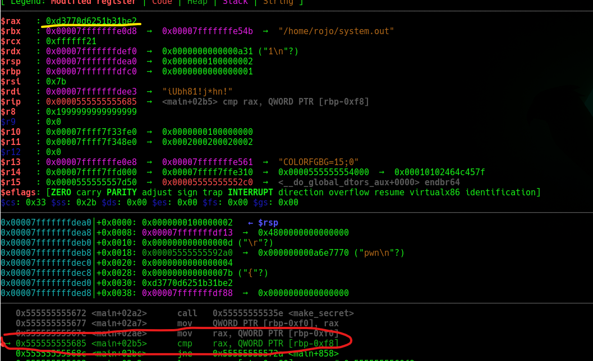

Pasamos el script por `Ghidra` para ver que hace, encontramos esta funcion importante

```c
hash = strtoul(input_password + 1,&local_120,10);
if (local_120 == input_password + 1) {
  printf("No digits were found");
                /* WARNING: Subroutine does not return */
  __assert_fail("1 == 0","heartbleed.c",0x45,"main");
}
hash_secret = make_secret(block);
if (hash_secret == hash) {
  local_f0 = fopen("flag.txt","r");
  if (local_f0 == (FILE *)0x0) {
    perror("Could not open flag.txt");
    uVar1 = 1;
    goto LAB_0010173e;
  }
  status_code = fgets(local_78,100,local_f0);
  if (status_code == (char *)0x0) {
    puts("Failed to read the flag");
  }
  else {
    printf("%s",local_78);
  }
  fclose(local_f0);
}
```

Basicamente si obtenemos el secreto nos daran la flag. La forma mas comoda que encontre, utilizando `gdb-gef`, para obtener el secreto fue colocando un `breakpoint` justo antes de la comparacion para leer directamente el registro, obteniendo el hash resultante.



Ya con eso tendriamos la flag

```
picoCTF{d0nt_trust_us3rs}
```